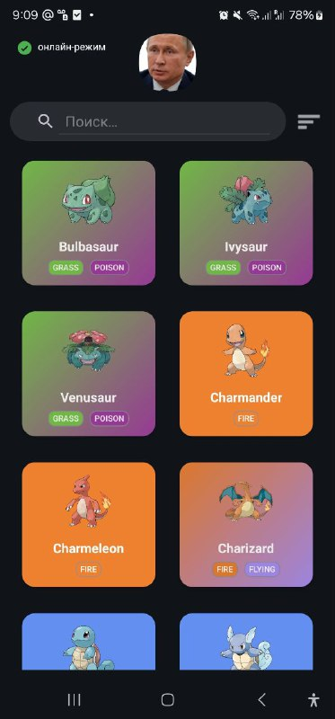
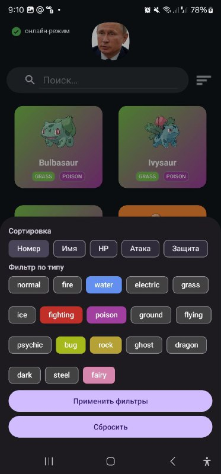

# Pockemon — описание проекта

## Скриншоты

  
  

## Назначение
Приложение для просмотра списка покемонов с возможностью поиска, сортировки и фильтрации по типам. Работает в оффлайн-режиме благодаря локальному кэшу (Room), поддерживает русскую локализацию и современный UI.

## Архитектура
Проект построен по многослойному принципу с чёткими границами между слоями:

- Presentation (UI)
  - `ui/MainActivity` — единственная Activity с классическим View-based UI (ViewBinding + RecyclerView).
  - `ui/PokemonAdapter` — адаптер для списка.
  - `presentation/PokemonViewModel` — состояние и бизнес-операции для экрана.
  - `presentation/state/UiState` — простая модель состояний экрана: Loading/Data/Error.
  - Вспомогательные утилиты в `presentation/util/`:
    - `ConnectivityMonitor` — мониторинг сети (регистрация колбэков и мгновенная проверка)
    - `FiltersBottomSheet` — создание и поведение нижнего листа с фильтрами (чипы, выбор сортировки)
    - `ActiveFiltersRenderer` — отрисовка активных фильтров в `ChipGroup`
    - `FabController` — анимации и показ/скрытие FAB при прокрутке
    - `SearchViewUtils` — настройка подсказки и цветов текста
    - `OrderLabels` — локализованные подписи для вариантов сортировки
    - `UiConstants` — константы UI (длительности, пороги, цвета)
    - `PrefsKeys` — ключи для SharedPreferences
    - `SplashAnimator` — анимация выхода SplashScreen с брендированием

- Domain
  - `domain/PokemonRepository` — контракт репозитория
  - `domain/usecase/*` — простые интеракторы на один вызов (страница/фильтрация/получение всех)
  - `domain/model/Pokemon` — доменная модель

- Data
  - Remote: `data/remote/PokemonApiService` (Retrofit + Moshi)
  - Local: `data/local/PokemonDatabase`, `PokemonDao`, `PokemonEntity` (Room)
  - Repository: `data/PokemonRepositoryImpl` — объединяет сеть и БД, маппит в доменную модель

- DI
  - `di/AppModule` — Dagger Hilt: провайдинг API, БД, DAO, репозитория и use-case’ов

## Поток данных
1. UI (через `ViewModel`) запрашивает данные из use-case’ов.
2. Репозиторий при необходимости тянет страницу из сети, достраивает детали, сохраняет в Room.
3. Из БД читаются списки, применяются фильтры и сортировка, результат преобразуется в UI-модель.

## UI и поведение
- Экран — `MainActivity` с:
  - SearchView (поиск по имени)
  - BottomSheet фильтров (чипы типов + варианты сортировки: номер/имя/HP/атака/защита)
  - Активные фильтры в виде чипов над списком (можно закрывать по одному или «очистить все»)
  - RecyclerView с адаптером и «простым бесконечным скроллом» (prefetch-порог из `UiConstants`)
  - FAB «вверх» с появлением/скрытием при прокрутке (`FabController`)
  - Индикатор режима онлайн/офлайн (`ConnectivityMonitor`)
  - Анимация выхода SplashScreen (`SplashAnimator`)

## Локализация
- Базовые строки — `res/values/strings.xml`
- Русские строки — `res/values-ru/strings.xml`
- Все пользовательские тексты вынесены в ресурсы; `MainActivity` и разметка используют `@string/...`

## Оффлайн и кэш
- Данные сохраняются в Room (`PokemonEntity`).
- При ошибках сети приложение показывает данные из кэша, если они есть.
- Отсутствие кэша отображается локализованным сообщением.

## Нестандартные решения и мотивы
- «Лёгкие» утилиты в `presentation/util/` вместо перегружения `Activity`:
  - Упрощают тестирование и переиспользование (например, `ConnectivityMonitor`, `FiltersBottomSheet`).
- BottomSheet фильтров генерирует чипы типов динамически — проще поддерживать.
- «Простой бесконечный скролл» вместо Paging 3 — осознанный компромисс ради простоты.
- Состояние UI (поиск/фильтры/позиция списка) сохраняется в `SharedPreferences` — быстро и прозрачно.
- `UiConstants` централизует «магические числа»: длительности анимаций, пороги, цвета.
- Локализация — целенаправленно приведена к русскому, тексты извлечены из кода.

## Технологии
- Kotlin, AndroidX
- Dagger Hilt (DI)
- Retrofit + OkHttp + Moshi (сеть/JSON)
- Room (локальное хранилище)
- ViewBinding, Material Components
- KSP (Room/Moshi/Hilt компиляторы)

## Контакты
УРСОЛ ГЛЕБ ВАДИМОВИЧ  
+7 914 722-92-09 (WhatsApp)
